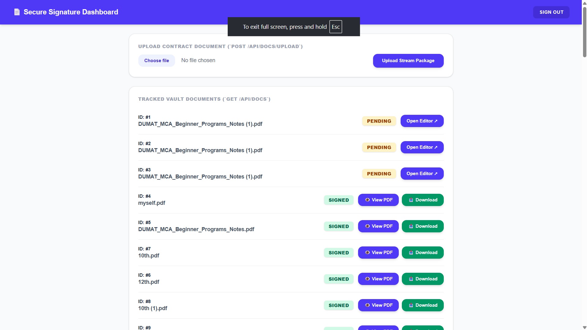
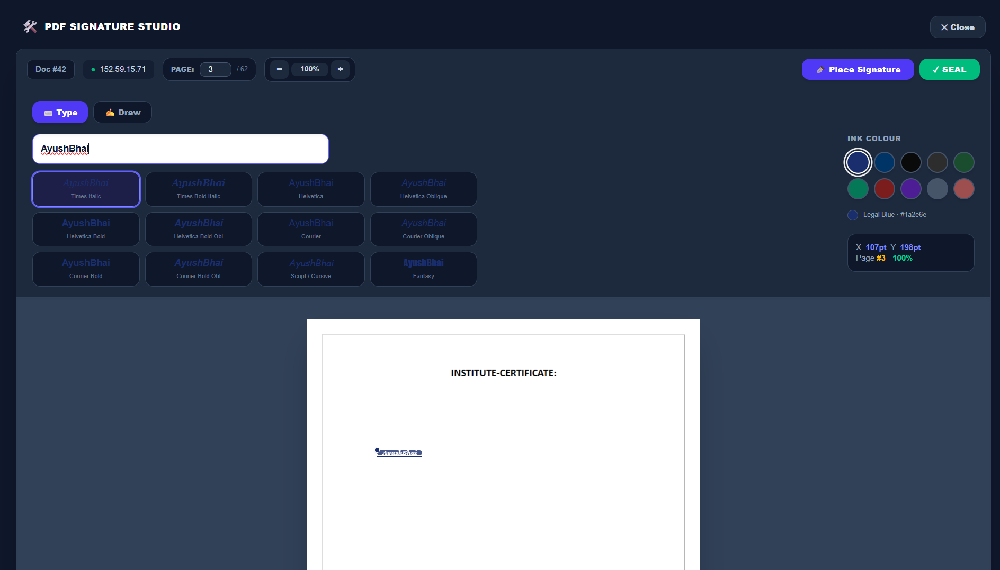
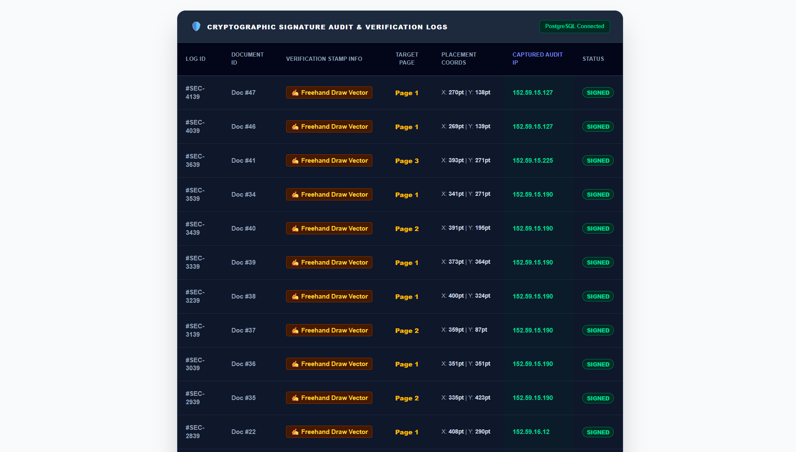

# 🖋️ Secure Digital Document Signature Platform

A full-stack document signing platform built during an engineering internship. The system enables users to securely upload PDFs, place signatures through an interactive canvas, permanently embed custom fonts into documents, and maintain an immutable activity log for auditing purposes.

---

## 📌 Overview

Traditional paper-based approvals are slow, difficult to manage, and vulnerable to tampering. This platform provides a secure digital workflow for signing PDF documents through a cloud-native architecture consisting of a Next.js frontend and a FastAPI backend.

Users can upload documents, position signatures with pixel-level accuracy, embed custom fonts directly into PDFs, and maintain verifiable activity records for compliance and tracking.

---

## ✨ Features

* 🔐 Secure user authentication
* 📄 PDF upload and management
* 🖋️ Interactive signature workspace
* 🎨 Custom TrueType font embedding
* 📍 Coordinate-based signature placement
* 📜 Immutable audit logging
* 📥 Signed PDF generation and download
* ⚡ Decoupled frontend and backend architecture
* 🐳 Dockerized deployment
* ☁️ CDN-powered document ingestion

---

## 🖼️ Screenshots

### 📊 Dashboard

The central interface for managing uploaded documents and monitoring document status.

```markdown

```

### 🖋️ Signature Workspace

Interactive canvas where users position signatures and customize fonts before embedding them into PDFs.

```markdown

```

### 📜 Audit Log Registry

Tracks user actions and document history for compliance and traceability.

```markdown

```

---

## 💻 Tech Stack

### Frontend

* Next.js
* React
* Tailwind CSS
* Vercel

### Backend

* FastAPI
* Python
* SQLAlchemy ORM
* JWT Authentication

### Infrastructure

* Hugging Face Spaces
* Uploadcare CDN

---

## 🏗️ Architecture

```text
Frontend (Next.js)
        │
        ▼
REST APIs
        │
        ▼
Backend (FastAPI)
        │
 ┌──────┴──────┐
 ▼             ▼
SQLAlchemy   Uploadcare CDN
Database

```

---

## 📂 Folder Structure

```text
signature/
├── frontend/
│   ├── public/
│   ├── src/
│   │   ├── components/
│   │   └── pages/
│   ├── package.json
│   └── README.md
│
└── backend/
    ├── app/
    │   ├── models/
    │   ├── routes/
    │   ├── utils/
    │   ├── config.py
    │   └── main.py
    ├── Dockerfile
    └── requirements.txt
```

---

## 🔗 Database Relationships

### User → Documents (1 : Many)

One authenticated user can manage multiple documents.

### User → Signatures (1 : Many)

A user can create multiple signatures across various documents.

### Document → Signatures (1 : Many)

Each document may contain multiple signature records and revisions.

---

## ⚙️ Installation

### Frontend

```bash
cd frontend
npm install
npm run dev
```

### Backend

```bash
cd backend
pip install -r requirements.txt
uvicorn app.main:app --reload
```

---

## 🚀 Real-World Applications

### HR & Onboarding

* Offer letters
* Employee agreements
* NDA processing

### Legal & Contract Management

* Procurement contracts
* Vendor approvals
* Service agreements

### Compliance & Auditing

* Document traceability
* User activity tracking
* Anti-tampering workflows

---

## 🏁 Challenges Solved

* Asynchronous file upload handling
* Docker container configuration issues
* TrueType font embedding into PDFs
* Coordinate-based signature rendering
* Decoupled frontend-backend communication

---

## 🔮 Future Enhancements

* Role-based access control
* Email notifications
* Digital certificates
* Cloud storage integration
* Multi-user collaboration
* Document versioning

---

## License

This project is intended for educational and internship purposes.

---
